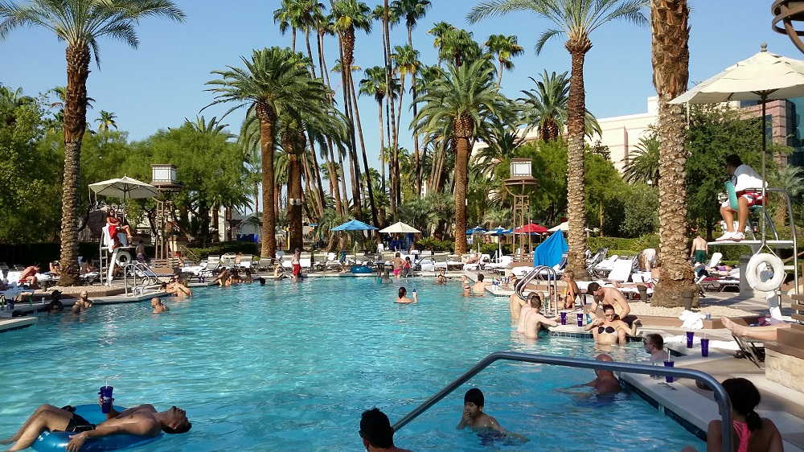

# Welcome to Bootstrap Demo 2

<strong>Salt and light from the book of Matthew Chapter 5:13~16</strong> (NIV)

You are the salt of the earth. But if the salt loses its saltiness, how can it be made salty again? 

It is no longer good for anything, except to be thrown out and trampled underfoot.

You are the light of the world. A town built on a hill cannot be hidden.

In the same way, let your light shine before others, that they may see your good deeds and glorify your Father in heaven.

## Sermon on the mount from the book of Matthew Chapter 5 (NIV)

 |  Verse | Description
 |------------|:--------------------------------------------------------------------------------------------------------------------------------------
 |  v. 3       | Blessed are the poor in spirit, for theirs is the kingdom of heaven. 
 |  v. 4       | Blessed are those who mourn, for they will be comforted. 
 |  v. 5       | Blessed are the meek, for they will inherit the earth. 
 |  v. 6       | Blessed are those who hunger and thirst for righteousness, for they will be filled.
 |  v. 7       | Blessed are the merciful, for they will be shown mercy. 
 |  v. 8       | Blessed are the pure in heart, for they will see God.
 |  v. 9       | Blessed are the peacemakers, for they will be called children of God. 

## My Vacation in 2015

  <ol class="carousel-indicators">
    <li data-target="#carousel2" data-slide-to="0" class="active"></li>
    <li data-target="#carousel2" data-slide-to="1"></li>
    <li data-target="#carousel2" data-slide-to="2"></li>
  </ol>
  

    

      
    

    

      
    

    

      
    

  

  <a class="left carousel-control" href="#carousel2" role="button" data-slide="prev">
    
    Previous
  </a>
  <a class="right carousel-control" href="#carousel2" role="button" data-slide="next">
    
    Next
  </a>

### More Links 

<a class="btn btn-info btn-sm" href="../index.html" role="button">GoTo Home</a> 
<a class="btn btn-primary btn-sm" href="../bootstrap/bootstrap-demo01.html" role="button">Bootstrap1</a>
<a class="btn btn-success btn-sm" href="../markdown/leadership.html" role="button">Leadership</a> 
<a class="btn btn-warning btn-sm" href="../markdown/EQ_QnA.html" role="button">What is EQ?</a>
<a class="btn btn-danger btn-sm" href="../markdown/successfulTeam.html" role="button">SuccessfulTeam</a>

