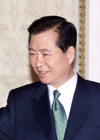

# Leadership

*Q: Identify a successful leader you have observed in a workplace and describe how he or she demonstrated the characteristics of effective leaders? How were these people leaders rather than merely managers?*
 

 In my experience at workplaces in the United States, my managers, are ‘real’ talented managers but I seldom mentioned them as ‘leaders’ not because I’m disqualifying them as leaders but because they became leaders not by votes.  For this reason, I want to introduce one real leader who had made a great impact on my life. He is pretty similar with Abraham Lincoln in the United States with some similarities from the list below:

1. He grew up in a very poor rural area and could not complete his schooling in a regular high school.
2. Half of the population eagerly supported him whereas another half of the population did not like him due to political reason just like Abraham Lincoln.
3. He had many strong followers who risked their lives in order to make him president in South Korea. And their dream came true.
4. His entire life was a dangerous journey and suffered a lot with three times near-death experiences.
5. He experienced a lot of failures in presidential elections but he did not give up to give hope to many people.
6. He received the Nobel Peace Prize in spite of many opponents making every effort to disqualify him in newspapers and public articles.
7. He feared God rather than men and so he prayed whenever he felt fear and suffering just like Abraham Lincoln made the White House a prayer’s house.

 
He was a great leader because he is a role model for many people who pursue to live for what is right but against some people who tries maintaining vested rights without taking any risks. After pondering his life once again, I try to summarize how he demonstrated the characteristics of effective leader.

 

First of all, his life had a mission statement that had impressed millions of others. He tried to root democracy in South Korea instead of ruling by military dictators just like North Korea even though it was not easy because, for more than three decades, military dictators were controlling the country persecuting him, kidnapping him to make him drown, and causing him to limp throughout entire his life. But eventually, his dream came true after he became a president in South Korea after severe hardships and sufferings. In some newspapers, he was considered as Nelson Mandela, who also Nobel Peace Prize laureate in 1993, in Asia.

Secondly, he made every effort to give hope for his many followers and so he never gave up his dream of Korean democracy in spite of his strong enemies, military dictators and their followers, who tried to kill him several times. This is the main reason why he became the role model of many young people in South Korea and his name also called D.J. will be remembered throughout Korean history.

 
 
Thirdly, he was a sympathetic leader who is truly caring for others listening carefully on what they want. He always called his people, “my respectful fellow citizens” although he knew half of his fellow citizens never voted for him. But after he was elected officially as president of South Korea in 1998, he started to embrace his enemies in spite of some objections among his people. He did not blame anyone who caused the Korean financial crisis hit in 1997 by incompetent leader at that time who built coalition with military dictators to become president proving to be the best example of Machiavellian individual.
 
 

Finally, he is not only great political leader in South Korea but also he proved to be the greatest economic leader in Korean history. When he became the president in early 1998, the entire country was deeply affected by the Asian (or Korean) financial crisis in 1997 and many economists all over the world were very much pessimistic about the situation that it may go to ruin with almost zero for foreign exchange holding. However, as soon as he became a president in his very old age, he worked very hard day and night eating lunch from lunch box every day to revive Korean economy embracing many of his enemies including former president, military dictator, who gave him death sentence. And after 5 years of presidency in South Korea in 2002, the foreign exchange holding was 4th biggest in the world (source: blog.ohmynews.com/wjs88/369775) and many economists from all over the world almost got shocked on how he managed to make the country revived so successfully and quickly from ruin.

 

In conclusion, it is relatively easy to be a manager than to be a leader. I am so glad that I have met one of the greatest Korean leaders in history in my time that I can always cherish and remember constantly reminding me on what true leaders are like. Even though he passed away few years ago, he still teaches many people on how to live and how to become a leader in many different aspects. Therefore, I call him a true leader or hero and not just a talented manager as his entire life proved that freedom is not free especailly in South Korea. 

Written by Sun-mi Kim

 

